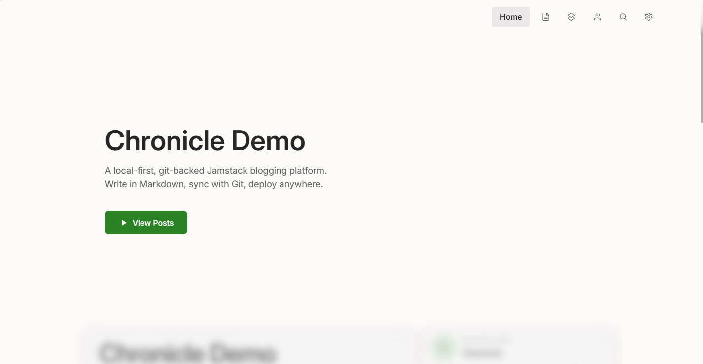
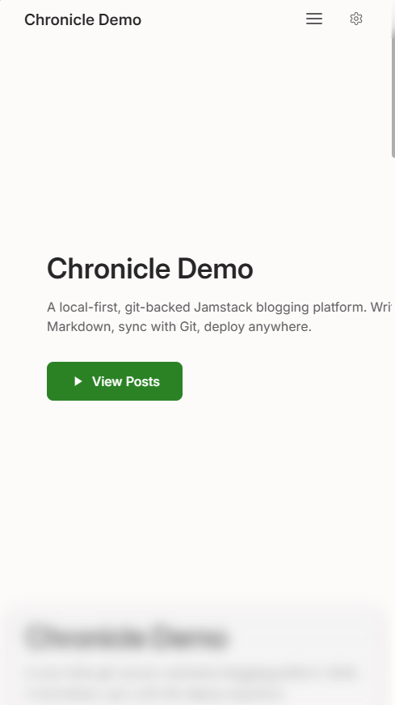

# Chronicle Aurora

[中文](README.zh.md) English

A Jamstack blog template. Clone and go — Markdown + YAML content, Git version control, one-command deploy to static CDN. Local-first: no database, no API server, no runtime.

Content is YAML + Markdown on the filesystem. [Astro](https://astro.build) SSG → static HTML. `git push` → CI → CDN.

## Features

<p align="center">
  
  
</p>

- **Static by default** — every page pre-rendered at build time. Fast, SEO-friendly, low client-side JS required for reading.
- **Markdown + frontmatter** — write posts in Markdown with YAML metadata. Familiar workflow, clean git diffs.
- **Dark / light theme** — color system derived from 3 foundation tokens. Toggle via UI or follow system preference.
- **i18n out of the box** — Chinese and English routes (`/zh/`, `/en/`). Add more languages by adding translation files.
- **Collection groups** — organize posts into curated guides or series with built-in navigation.
- **Friends / blogroll** — showcase other sites with avatars, descriptions, and links.
- **Marp slides** — turn any post into a presentation. Markdown → slide deck with themes and transitions.
- **Built-in search** — client-side full-text search across all blog posts.
- **Comments** — support for Staticman, GitHub Issues, Twikoo, or disable entirely. New comments land in a pending folder for review.
- **RSS feed** — auto-generated, always up to date.
- **Responsive layout** — readable on phones, tablets, and desktops.
- **Image pipeline** — drop images into `data/` directories. Auto-compressed to WebP/AVIF at build time.

## Structure

```
data/                        — Your content: posts, images, config. The single source of truth.
packages/template-astro/     — Astro frontend (pages, styles, components)
packages/manager/            — Content manager (WIP)
packages/shared/             — Shared types & utilities
```

## Quick Start

```bash
# 1. Fork and clone
git clone https://github.com/<your-username>/chronicle-aurora.git
cd chronicle-aurora

# 2. Install dependencies
npm install

# 3. Start the dev server
cd packages/template-astro && npm run dev     # http://localhost:4321

# 4. Build for production
npx astro build --root packages/template-astro  # output → dist/

# 5. Preview the production build
npx astro preview --root packages/template-astro
```

## Deployment

The `packages/template-astro/dist/` directory is a complete static site. Deploy to any CDN or static host.

**Git-based workflow:**

1. Write content in `data/`
2. `git commit && git push`
3. CI runs `npx astro build` and deploys `packages/template-astro/dist/` to CDN
4. That's it.

Typical CI config (GitHub Actions, Cloudflare Pages, etc.): `npm install && npx astro build --root packages/template-astro`, output `packages/template-astro/dist`.

## License

MIT
