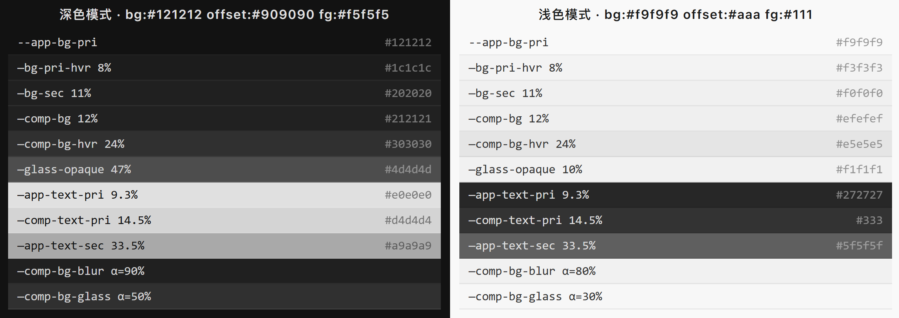
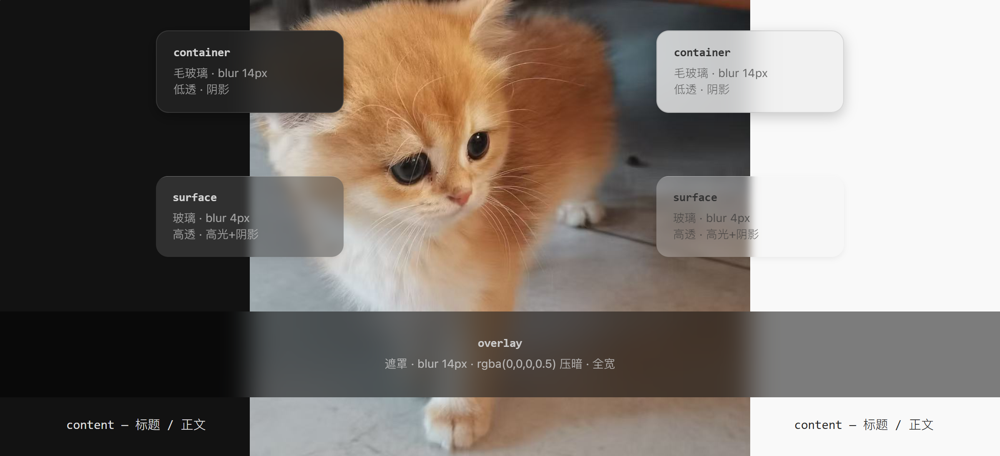
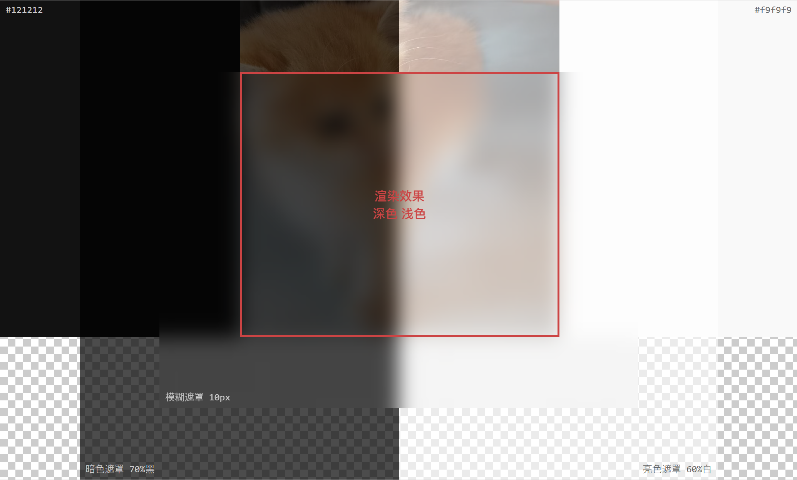

## 前言
Chronicle 的设计以玻璃为主要 UI 元素，因此半透明和模糊叠层几乎用于所有组件。这对 UI 设计提出了很高的要求。我们需要兼顾：

1. 美观的视觉效果，这是设计的终极目标；
2. 设计语言统一；
3. 代码逻辑顺畅，易于维护；
4. 客户端侧尽量小的网络和渲染压力。

综合考虑，Chronicle 使用原生 CSS 功能来实现绝大多数的材质、布局和动画效果，使用适当的设计技巧来实现很多视觉效果，并使用 CSS 分割、内联、变量替换等方式实现低 CSS 解析用时，以优化客户端性能。

---

## 颜色系统

### 核心设计原则

**一套混色公式，两套基底变量。**

所有颜色均由 `color-mix()` 派生，深浅色模式共用完全相同的混色比例与派生逻辑。模式切换时，仅需替换基底变量（`--bg-base`、`--fg-base`、`--bg-offset`、`--hl-offset`）的值，所有衍生颜色自动适配。


### 基底变量

| 变量 | 深色模式 | 浅色模式 | 作用 |
| --- | --- | --- | --- |
| `--bg-base` | `#121212` | `#f9f9f9` | 背景基底（最深／最浅） |
| `--fg-base` | `#f5f5f5` | `#111` | 前景基底（最亮／最暗） |
| `--bg-offset` | `#909090` | `#aaa` | 亮度偏移量，用于混合派生 |
| `--hl-offset` | `var(--bg-offset)` | `var(--accent)` | 高光偏移量 |

**色卡：**



> 深色模式以 `#909090` 为偏移量混入 `#121212` 产生层级灰阶，浅色模式以 `#aaa` 为偏移量混入 `#f9f9f9`。前景文字反向混合。`--glass-opaque` 在浅色模式下有独立覆盖（10% 替代 47%），其余公式完全一致。

### 派生规则

所有颜色变量采用统一的派生逻辑，以深色模式为例：

```
--app-bg-pri          = var(--bg-base)                              → #121212
--app-bg-pri-hvr      = color-mix(in srgb, var(--bg-offset) 8%, var(--bg-base)) → #191919
--comp-text-pri       = color-mix(in srgb, var(--bg-base) 14.5%, var(--fg-base)) → #d4d4d4
```

派生变量按用途分为以下类别：

| 分类 | 变量示例 | 派生公式 |
| --- | --- | --- |
| 应用背景层级 | `--app-bg-pri`、`--app-bg-sec`、`--app-bg-sec-hvr` | `var(--bg-base)` 混入 `var(--bg-offset)` 5%–17% |
| 组件背景层级 | `--comp-bg`、`--comp-bg-hvr`、`--comp-bg-alt` | `var(--bg-base)` 混入 `var(--bg-offset)` 12%–24% |
| 玻璃不透明基色 | `--glass-opaque`、`--glass-opaque-hvr` | `var(--bg-base)` 混入 `var(--bg-offset)` 47%–60% |
| 模糊材质（半透明） | `--comp-bg-blur`、`--comp-bg-blur-hvr` | 上述基色 × `--blur-alpha`（90%）混入透明 |
| 玻璃材质（半透明） | `--comp-bg-glass`、`--comp-bg-glass-hvr` | 上述基色 × `--glass-alpha`（50%）混入透明 |
| 强调色背景 | `--comp-bg-accent`、`--comp-bg-accent-blur` | `var(--accent)` 混入透明 |
| 应用文字 | `--app-text-pri`、`--app-text-sec` | `var(--fg-base)` 混入 `var(--bg-base)` 9.3%–33.5% |
| 组件文字 | `--comp-text-pri`、`--comp-text-sec` | `var(--fg-base)` 混入 `var(--bg-base)` 14.5%–35.2% |
| 边框 | `--border-color`、`--border-color-blur` | 文字色或偏移量混入透明 |
| 交互叠加层 | `--hover`、`--active`、`--highlight` | `var(--bg-offset)` 混入透明 |
| 阴影 | `--shadow-sm`、`--shadow-md`、`--shadow-lg` | `rgba(0,0,0, α)` — α 值共用 |
| 高光 | `--highlight-glass`、`--highlight-edge` | 白色半透明描边 — 透明度共用 |
| 遮罩压暗 | `--overlay-dim` | `rgba(0,0,0, α)` — α 值共用 |


### 模式切换机制

```css
/* 深色模式（默认） */
:root {
  --bg-base: #121212;
  --fg-base: #f5f5f5;
  --bg-offset: #909090;
  --hl-offset: var(--bg-offset);
}

/* 浅色模式 — 仅需重定义基底变量 */
[data-theme="light"] {
  --bg-base: #ffffff;
  --fg-base: #121212;
  --bg-offset: #6b6b6b;
  --hl-offset: var(--accent);
}
```

切换 `data-theme` 后，所有经由 `color-mix()` 派生的颜色自动更新，无需逐一声明。


### 例外：不共用的样式

绝大多数样式深浅共用一套混色公式与派生逻辑，少数样式如**代码高亮相关样式**例外——强调色在深浅模式下各自独立定义，不通过基底变量派生。

---

## 层级与基本材质

### 概述

本系统依据**交互优先级**、**显示逻辑**与**用户直觉**，将界面元素划分为5个材质层级。每个层级对应一种视觉材质，通过模糊度、透明度、阴影与高光的差异化组合，在保持视觉层次丰富的同时，确保信息清晰可读。

### 层级总览

| 层级 | 材质 | 视觉特征 | 中文描述 | 核心用途 |
| --- | --- | --- | --- | --- |
| `background` | Solid | 不透明，高对比色 | 全局背景 | 页面根基，承载所有上层元素 |
| `container` | Blur | 高模糊，低透，有阴影 | 悬浮式容器 | 临时面板、抽屉、弹窗基底 |
| `surface` | Glass | 低模糊，高透，有高光+阴影 | 可交互表面 | 卡片、按钮、列表项 |
| `overlay` | Depth | 模糊，压暗 | 遮罩 | 模态框背景、图片预览衬底 |
| `content` | - | 通常背景透明，样式由内容决定 | 内容 | 标题、正文、图标等内嵌信息 |




### 各层级详细定义

#### 1. `background` — 全局背景

- **外观**：纯色填充，不透明，采用高对比色（如浅色模式 `#f9f9f9`，深色模式 `#121212`）
- **典型用例**：页面主背景、应用底板
- **例外**：`<input>` 等表单输入控件可使用此色以保持“凹陷”感

#### 2. `container` — 悬浮式容器

- **外观**：毛玻璃效果，高模糊度（≥12px），低透明度，底部投射柔阴影
- **典型用例**：`.panel-card`（首页信息卡片）、`.modal-base`（弹窗基座）、`.dropdown-wrap`（下拉菜单）
- **约束**：不可直接嵌套另一个 `container`

#### 3. `surface` — 可交互表面

- **外观**：玻璃质感，低模糊度（4-10px），高透明度，具备顶部高光条与底部阴影
- **典型用例**：`.post-card`（内容卡片）、`.menu-item`（菜单项）、`.action-sheet`（操作表）
- **例外**：`.sidebar` 可使用 `surface` 材质以保持沉浸，但是需要使用变体类来避免使用悬停样式
- **约束**：可在 `container` 内部使用，不可嵌套另一个 `surface`

#### 4. `overlay` — 遮罩

- **外观**：背景模糊（4-20px），叠加50%黑色压暗层
- **典型用例**：`.image-preview-overlay`（图片查看器背景）、`.modal-overlay`（弹窗外遮罩）
- **例外**：`.bg-overlay`（背景装饰性遮罩）模糊和压暗由用户决定，不受全局样式控制
- **约束**：Z-index 夹在聚焦层和下层之间

#### 5. `content` — 内容

- **外观**：背景透明，无预设样式，由具体内容类型决定（文字、图标、图片等）
- **典型用例**：`.card-post-title`、`.panel-description`
- **约束**：在下层没有`surface`或`container`时，可以嵌套这两种元素，背景保持透明以透出父级材质

---

### 嵌套规则

| 父层级 | 允许嵌套的子层级 | 禁止嵌套 |
| --- | --- | --- |
| `background` | `container`、`surface`、`overlay`、`content` | `background` |
| `container` | `surface`、`content` | `container`、`background` |
| `surface` | `content` | `surface`、`container`、`background` |
| `overlay` | `content`、`container`、`surface` | `background` |
| `content` | `container`、`surface`（有条件） | `background` |


### 材质层级颜色映射

| 层级 | 背景变量 | 文字变量 | 边框变量 | 状态叠加 |
| --- | --- | --- | --- | --- |
| `background` | `--app-bg-pri` | `--app-text-pri` | — | — |
| `container` | `--comp-bg-blur` | `--comp-text-pri` | `--border-color-blur` | `--comp-bg-blur-hvr`／`--comp-bg-blur-active` / `--comp-bg-blur-hl` |
| `surface` | `--comp-bg-glass` | `--comp-text-pri` | `--border-color-blur` | `--comp-bg-glass-hvr`／`--comp-bg-glass-active` / `--comp-bg-glass-hl` |
| `overlay` | `rgba(0,0,0,.5)` | — | — | — |
| `content` | 透明 | `--app-text-pri`／`--app-text-sec` | — | `--hover` / `--active` / `--highlight` |

---

### 使用方法（即将添加）

在class列表中添加对应的层级名称即可，如：
```html
<div class="post-card surface">卡片文本</div>

<style>
.post-card {
	/* surface未覆盖的变量可在此定义 */
}
.post-card.surface {
	/* 覆盖surface的变量 */
}
</style>
```

---

## Critical CSS

Chronicle 将 CSS 拆分为**首屏内联**与**异步加载**两部分，确保首次绘制时几乎零网络往返。

### 拆分策略

| 文件 | 大小 | 加载方式 | 说明 |
| --- | --- | --- | --- |
| `critical-tokens.css` | 5.6 KB | `<style>` 内联 | 深浅两套设计令牌，所有页面强制首屏 |
| `critical-base.css` | 3.7 KB | `<style>` 内联 | 全局布局骨架，所有页面强制首屏 |
| `critical-home.css` | 4.2 KB | `<style>` 内联 | 首页专用，仅首页注入 |
| `critical-post.css` | 4.8 KB | `<style>` 内联 | 文章页专用，仅文章页注入 |
| `critical-blogs.css` | 2.1 KB | `<style>` 内联 | 博客列表页专用 |
| `critical-search.css` | 1.1 KB | `<style>` 内联 | 搜索页专用 |
| `global.css` | 6.8 KB | `<link>` 异步 | 完整令牌 + 全局样式，非阻塞 |
| `app.css` | — | `<link>` 异步 | 组件样式，非阻塞 |

### 按路由按需注入

```javascript
// Layout.astro — 服务端根据 pathname 决定注入哪些 critical CSS
const pathname = Astro.url.pathname;
const isHome   = /^\/(en|zh)\/?$/.test(pathname);
const isPost   = pathname.includes('/post/');
const isBlogs  = /\/(en|zh)\/blogs\/?$/.test(pathname);
const isSearch = pathname.includes('/search');

const criticalCSS = [
  criticalBase,                           // 始终包含
  isHome   ? criticalHome   : '',
  isPost   ? criticalPost   : '',
  isBlogs  ? criticalBlogs  : '',
  isSearch ? criticalSearch : '',
].join('');
```

### 内联顺序

`<head>` 中的注入顺序保证变量先于样式解析：


1. `<script>` 设置 `data-theme`（阻塞，在 CSS 之前）
2. `<style>` `critical-tokens.css`（CSS 变量定义）
3. `<style>` SSR 变量注入（`--accent` 等运行时常量）
4. `<style>` `criticalCSS`（页面专用骨架，`var()` 引用均可解析）
5. `<link>` `global.css`（异步，不阻塞渲染）

### 设计约束

- **tokens 文件与 global.css 中的公式必须严格一致**——否则异步加载完成后会出现颜色闪烁
- 字体使用 `media="print" onload="this.media='all'"` 模式加载，确保文字立即以回退字体渲染
- 背景图片渲染延迟至 LCP 之后，不参与首屏竞争
- 页面切换时 `transition:persist` 完整保留背景层 DOM，无需重建

### 首屏 CSS 体积

| 页面类型 | 内联 CSS 总大小 |
| --- | --- |
| 首页 | ~13.5 KB（tokens + base + home） |
| 文章页 | ~14.1 KB（tokens + base + post） |
| 博客列表 | ~11.4 KB（tokens + base + blogs） |
| 搜索页 | ~10.4 KB（tokens + base + search） |

全部控制在 ~15 KB 以内，单次 TCP 慢启动窗口即可传输完毕。

---

## 背景系统

Chronicle 使用一个专用 DOM 层 `#chronicle-bg-layer` 承载所有背景渲染，与页面内容完全分离。

### 为什么不用 body 背景

- `body::before` / `body::after` 伪元素不可被 View Transitions 持久化
- 背景图片需要在 SPA 页面切换时平滑过渡，而非重新加载
- 用户自定义背景需要独立的模糊、压暗、不透明度控制
- 为未来视频背景预留通道

### 三层叠放架构

```
#chronicle-bg-layer (fixed, z-index:0, pointer-events:none)
  ├── .bg-surface   (z-index:1) — 纯色底色
  ├── .bg-image     (z-index:2) — 背景图片
  └── .bg-overlay   (z-index:3) — 遮罩 + 模糊
```

**示意图：**


*实际合成中`bg-overlay`的模糊和半透明遮罩是同时叠加的，此图只是为了方便展示设置模糊和未设置模糊时不同的效果*

| 层 | 变量 | 说明 |
| --- | --- | --- |
| `.bg-surface` | `--bg-surface-color` | 纯色底色。优先使用站点配置的深/浅底色（`frontendBackgroundColor`），否则回退 `--app-bg-pri` |
| `.bg-image` | `--frontend-bg-image` 等 | 背景图片。JS 在 LCP 之后异步加载并写入 CSS 变量。加载完成后添加 `.is-ready` 类触发 `opacity: 1` 淡入 |
| `.bg-overlay` | `--frontend-bg-overlay` | 遮罩层。深浅模式分别使用 `-light` / `-dark` 后缀变量，由 JS 按当前主题解析 |

### CSS 变量接口

```css
/* 用户可在 site.yml 中配置，由服务端注入或 JS 运行时写入 */
--frontend-bg-image: url(...);      /* 背景图片 */
--frontend-bg-pos: 50% 50%;         /* 图片定位 */
--frontend-bg-size: cover;          /* 图片填充策略 */
--frontend-bg-blur: 0px;            /* 图片模糊（用户可调） */
--frontend-bg-opacity: 1;           /* 图片不透明度 */
--frontend-bg-overlay-light: ...;   /* 浅色模式遮罩 */
--frontend-bg-overlay-dark: ...;    /* 深色模式遮罩 */
```

### 渲染时机

1. **首屏**：仅渲染 `.bg-surface` 纯色底板，零额外开支
2. **LCP 之后**：JS 异步加载背景图片，fetch → blob → objectURL → 写入 `--frontend-bg-image`
3. **页面切换**：`transition:persist="background-layer"` 完整保留 DOM、inline style、class，无需重建
4. **img 标签模式**：`html.bg-no-img` 类隐藏背景图层，由页面内嵌 `` 接管

### 聚焦模式

阅读文章时，`html.focus` 将 `.bg-overlay` 强制设为 `#000`，压暗全屏以突出内容。

---

## 字体与排版

### 字体栈

Chronicle 使用可变字体 Inter 作为主字体，通过 CSS 变量提供三种字体栈供不同场景切换：

| 变量 | 字体 | 用途 |
| --- | --- | --- |
| `--app-font-stack-inter` | `InterVariable`, `Inter` → system fallback | 默认正文（前端） |
| `--app-font-stack-system` | system-ui 原生字体 | 备选（不加载 Inter 时） |
| `--app-font-stack-serif` | `Noto Serif SC`, serif | 文章正文（用户可选） |
| `--app-font-stack-mono` | `SF Mono`, `Consolas`, `Menlo` → monospace fallback | 代码块、等宽场景 |
| `--backend-font-stack` | 默认同 `inter` | 后台管理界面独立控制 |

### 可变字重策略

Inter 是可变字体，允许精确控制字重而不引入额外的字体文件：

| 变量 | 值 | 说明 |
| --- | --- | --- |
| `--app-text-wght` | `400`（暗）/ `430`（亮） | 正文。浅色模式字重略高，补偿白底视觉偏细 |
| `--app-heading-wght` | `570` | 标题。比 `600` 略低，避免过粗导致的视觉闪烁 |

使用 `font-variation-settings: 'wght' ...` 而非 `font-weight`，确保在可变字体不加载时回退到 `font-weight` 声明。

### 字号层级

```
h1 → 2.5em    h2 → 2.1em    h3 → 1.7em
h4 → 1.4em    h5 → 1.2em    h6 → 1em
section-title → 1.8em
```

使用 `em` 相对单位，尊重用户默认字体大小设置。

### 字体加载策略

Inter 字体 CSS 使用 `media="print" onload="this.media='all'"` 模式：

- 首屏立即以系统回退字体渲染，无 FOIT
- 字体文件异步加载，完成后自动切换，用户感知为"字体渐变"
- `noscript` 后备确保禁用 JS 时正常加载

衬线字体（Noto Serif SC）通过 Google Fonts 加载，仅在 `frontendFont: 'serif'` 时引入。

```html
<!-- Inter: 非阻塞 -->
<link rel="stylesheet" href="/fonts/inter.css" media="print"
      onload="this.media='all'" />

<!-- Noto Serif SC: 仅衬线模式加载，preconnect 预热 -->
<link rel="preconnect" href="https://fonts.googleapis.com" />
<link rel="preconnect" href="https://fonts.gstatic.com" crossorigin />
```

---

## 总结

Chronicle Aurora 的 CSS 设计围绕四个核心决策展开：

**一套公式，两套变量。** 颜色系统完全建立在 `color-mix(in srgb, ...)` 之上。深色模式与浅色模式共用完全相同的混合比例——切换时仅替换 4 个基底变量（`--bg-base`、`--fg-base`、`--bg-offset`、`--hl-offset`），所有派生颜色自动翻转。唯一的例外是品牌强调色，深浅模式各自独立定义。

**五级材质，统一语义。** `background` → `container` → `surface` → `overlay` → `content`，按交互优先级与视觉深度递进。每级材质对应固定的 CSS 变量集（背景、文字、边框、状态叠加），组件只需声明层级类名即可获得一致的材质表现。玻璃质感通过 `backdrop-filter` + 半透明背景 + inset 白色高光 + 投影组合实现，纯 CSS，零额外 DOM。

**内联首屏，异步全量。** Critical CSS 按路由拆分：令牌（5.6 KB）+ 骨架（3.7 KB）+ 页面专用（1–5 KB），全部内联在 `<head>` 中，首屏零网络往返。全局样式和组件样式通过 `media="print"` 技巧异步加载，不阻塞渲染。构建时自动重写 Astro 生成的 `<link>` 标签，无需手动维护。

**背景分离，延迟渲染。** 使用专用 DOM 层 `#chronicle-bg-layer` 承载背景，三层叠放（surface → image → overlay），通过 `transition:persist` 在 SPA 页面切换时完整保留。图片加载延迟至 LCP 之后，首屏仅渲染纯色底板。

最终效果：一个支持深浅模式、具备统一玻璃材质语言、首屏 CSS < 15 KB 的博客主题系统。