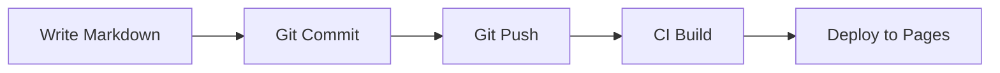
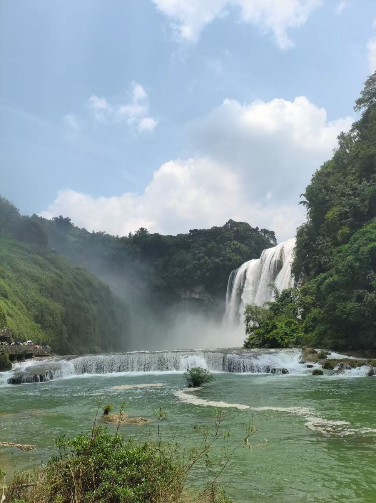

Chronicle renders Markdown with **markdown-it** plus a curated set of plugins. This post demonstrates everything you can do.

## Text Formatting

**Bold**, *italic*, ~~strikethrough~~, `inline code`, [links](https://chronicle.blog), and <u>underline</u>.

> Blockquotes are great for callouts. Use them to highlight key points or quote sources.
>
> — Someone Important

## Code Blocks

Syntax highlighting for dozens of languages:

```typescript
// TypeScript example
interface Post {
  slug: string
  title: string
  date: string
  status: 'draft' | 'published'
}

function getPublishedPosts(posts: Post[]): Post[] {
  return posts.filter(p => p.status === 'published')
}
```

```python
# Python example
def fibonacci(n: int) -> list[int]:
    a, b = 0, 1
    result = []
    for _ in range(n):
        result.append(a)
        a, b = b, a + b
    return result
```

## Tables

| Feature | Status | Notes |
|---------|--------|-------|
| Markdown editing | ✅ | Full split-screen preview |
| Collections | ✅ | Nested groups + breadcrumbs |
| Comments | ✅ | GitHub Issues / Twikoo |
| RSS | ✅ | Auto-generated |
| Search | ✅ | Client-side index |
| i18n | ✅ | English, Chinese |

## Math (KaTeX)

Inline: $E = mc^2$

Block:

$$
\int_{-\infty}^{\infty} e^{-x^2} \,dx = \sqrt{\pi}
$$

## Diagrams (Mermaid)



## Lists

### Unordered
- Chronicle runs on your machine
- No server required
- Content lives in Git
  - Every change is versioned
  - Roll back anytime

### Ordered
1. Write a post
2. Preview locally
3. Sync to deploy
4. Done — your post is live

### Task Lists
- [x] Build the CMS
- [x] Ship v3.0
- [ ] World domination

## Horizontal Rule

---

Above the line is one section. Below is another.

## Images

Chronicle supports three ways to reference images:

### 1. Attachment — stored in the post directory

Place images alongside `index.md` and reference them by filename. No path prefix needed — the build pipeline resolves them automatically.

``

Preview:   


### 2. Global assets — shared across posts

Upload to `data/assets/` via the CMS media library, then reference with the `asset://` protocol. Great for images reused across multiple posts.

``

Preview:


### 3. External URL — any image on the web

Hotlink images from CDNs, image hosts, or anywhere with a public URL. Build pipeline downloads and optimizes them.


> Chronicle's build pipeline auto-compresses all images to WebP and AVIF, regardless of source. The browser receives a `<picture>` element with multiple format fallbacks.


---

That covers all the formatting Chronicle supports. Everything in this post was written in plain Markdown and rendered by the same pipeline your posts will use.
