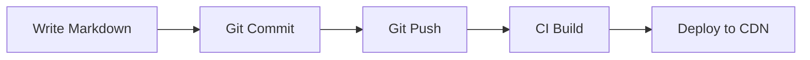

Chronicle renders Markdown with **markdown-it** plus a curated set of plugins, then sanitizes the output with **DOMPurify** — content is cleaned at write time in the Manager and injected with `set:html` at read time on the SSG, so the preview and the published page always match. This post demonstrates every syntax Chronicle supports, from headings and tables to KaTeX, Mermaid, and collapsible sections.

## Heading Levels

`#` through `######` produce six levels. The **H1** is reserved for the post title (taken from frontmatter), so body sections start at H2. The headings below render at H3–H6, each with its own size and weight:

### This is an H3 Heading
#### This is an H4 Heading
##### This is an H5 Heading
###### This is an H6 Heading

## Text Formatting

- **Bold** — wrapped in two asterisks or underscores
- *Italic* — wrapped in single asterisks or underscores
- ***Bold and italic*** — three asterisks
- ~~Strikethrough~~ — wrapped in double tildes
- `Inline code` — wrapped in backticks, rendered in a monospace font
- Emoji — typed directly: 🎉 ✅ 🚀

Footnotes are supported, too: this sentence carries a note[^1] that renders at the end of the post with a back-link.

[^1]: This is the footnote text. Chronicle uses markdown-it-footnote to collect and render them.

## Blockquotes

> Chronicle is local-first: content lives in `data/` as Markdown and YAML, and **Git is the API** — commit to save, push to deploy.
>
> — The Chronicle Aurora team

Blockquotes are styled as callouts, and they nest naturally — put a `>` inside a `>` for a nested quote.

## Lists

### Unordered

- Chronicle runs on your machine
- No server, no database — just files
  - Every change is versioned by Git
  - Roll back anything, anytime

### Ordered

1. Write a post
2. Preview locally
3. Commit and push
4. CI builds and deploys — your post is live

### Task Lists

- [x] Build the CMS
- [x] Ship 3.1
- [ ] Achieve world domination

Task lists render as interactive checkboxes; the box state is controlled by the `[x]` / `[ ]` marker.

## Tables

| Feature | Status | Notes |
|:--------|:------:|------:|
| Markdown editing | ✅ | Split-screen preview |
| Collections | ✅ | Nested groups + breadcrumbs |
| Comments | ✅ | Static JSON or Waline |
| RSS | ✅ | Auto-generated |

The `:---` markers control column alignment — left, center, and right, as shown above. Tables wrap on small screens with horizontal scrolling.

## Links

- External: [Chronicle](https://chr.eightyfor.top)
- Internal post: [Welcome to Chronicle](post://welcome-to-chronicle)

The `post://<id>` protocol links to another post by its **id** — the same id that appears in the address bar and keys `posts/index.json`. Because the id never changes, internal links stay valid across renames.

## Code Blocks

Fenced code blocks take a language tag after the opening backticks. The rendered block shows the **language label and a line count** in its header bar, with syntax highlighting:

```typescript
// TypeScript example
interface Post {
  slug: string
  title: string
  date: string
  status: 'draft' | 'published'
}

function getPublishedPosts(posts: Post[]): Post[] {
  return posts.filter(p => p.status === 'published')
}
```

```python
# Python example
def fibonacci(n: int) -> list[int]:
    a, b = 0, 1
    result = []
    for _ in range(n):
        result.append(a)
        a, b = b, a + b
    return result
```

Inline code — like `npm run build` or `data/posts/<id>/index.md` — uses backticks and keeps the surrounding text on the same line.

## Images

Chronicle supports three ways to reference images, and every one of them passes through the image pipeline (lazy loading, placeholder, and a broken-image fallback). External URLs are fetched through the pipeline's proxy.

Optional extras: a `title` in quotes becomes the caption, and an `=WxH` suffix hints at dimensions so the renderer can reserve space while loading — e.g. ``.

### 1. Attachments — images in the post directory

Drop the file next to `index.md` and reference it by filename. No prefix needed:

``


### 2. Shared assets — `asset://` from `data/assets/`

Upload once to `data/assets/` and reuse it from any post via the `asset://` protocol. Perfect for logos and photos shared across posts:

``


### 3. External URLs — any image on the web

Hotlink from a CDN or image host; the build fetches and optimizes it:


## Math with KaTeX

Inline math is wrapped in single dollar signs: $E = mc^2$. Display math uses a double-dollar block:

$$
\int_{-\infty}^{\infty} e^{-x^2} \, dx = \sqrt{\pi}
$$

KaTeX renders server-side and client-side, so formulas look identical in the preview and on the published page.

## Diagrams with Mermaid



Mermaid fences render as interactive SVG diagrams — flowcharts, sequence diagrams, Gantt charts, and more.

## Collapsible Sections

<details>
<summary>Click to expand — how sanitization works</summary>

Markdown is converted to HTML by markdown-it, then cleaned by DOMPurify against the shared whitelist. The Manager sanitizes at write time; the SSG injects the trusted HTML with `set:html` at read time. Both sides run the identical pipeline.

</details>

Wrap any content — text, lists, even code blocks — in `<details>` / `<summary>` to make it collapsible.

## Horizontal Rule

---

Above the line is one section; below is another.

## The `data/` Layout Behind This Post

| Path | Role |
|------|------|
| `data/posts/markdown-showcase/index.md` | Frontmatter + Markdown body |
| `data/posts/markdown-showcase/waterfall.jpg` | Local attachment |
| `data/assets/meow.jpg` | Shared resource via `asset://` |
| `data/background/`, `data/avatar/` | Auto-discovered background and avatar |

Everything in this post was written in plain Markdown and rendered by the same pipeline your posts use — sanitized at write time, rendered with `set:html` at read time.
