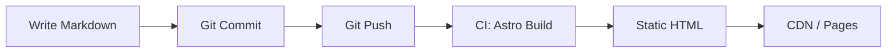

<!-- paginate: true -->
<!-- _paginate: false -->
<!-- _class: lead -->
# Chronicle Aurora

## Local-first · Git-backed · Jamstack

---

# The Problem

Every blogging platform wants you to **trust their server**.

| Platform | Runs on |
|----------|---------|
| WordPress | Your VPS |
| Medium | Their cloud |
| Ghost | Your VPS |
| Substack | Their cloud |

What if you don't want a server at all?

---

# The Answer: Filesystem

```
data/
├── posts/
│   └── hello-world/
│       ├── index.md      ← Your words
│       └── photo.png     ← Your images
├── site.yml               ← Your config
└── profile.yml            ← Your identity
```

**No database. No API. No server.**
Just Markdown, YAML, and Git.

---

# Three Principles

1. ✍️ **Write** — Markdown in a native editor with live preview
2. 🔄 **Sync** — One click. Git commit + push.
3. 🚀 **Deploy** — GitHub Actions builds static HTML. Served from CDN.

---

# The Pipeline



No runtime = no server to patch, no database to back up.

---

# What You Get

- 📝 **Markdown editor** with live split-pane preview
- 🏷️ **Collections** with nested groups and breadcrumbs
- 💬 **Comments** via GitHub Issues or Twikoo
- 🔍 **Client-side search** with tag filtering
- 📡 **RSS + Sitemap** auto-generated
- 🌐 **i18n** — English and Chinese out of the box
- 🎨 **Themes** — light, dark, or follow system

---

# Image Pipeline

```
photo.jpg
  ├── sharp → photo.webp (80% quality)
  └── sharp → photo.avif (55% quality)

Browser picks the best format:
<picture>
  <source srcset="photo.avif" type="image/avif">
  <source srcset="photo.webp" type="image/webp">
  
</picture>
```

Blazing fast. Zero config.

---

# Collections

```yaml
collections.yml:
- name: Chronicle Guide
  slug: chronicle-guide
  nodes:
    - id: welcome-to-chronicle
      type: post
    - type: group
      title: Deep Dives
      children:
      	...
```

Posts → Groups → Breadcrumbs → Navigation. All automatic.

---

# Start Today

```bash
git clone https://github.com/vanvanhasnophi/chronicle-aurora
cd chronicle-aurora
cd packages/manager && npm install && npm run dev
```

1. Open the CMS at `http://localhost:5173`
2. Create a post
3. Click Sync
4. Your blog is live

---

<!-- _paginate: false -->
<!-- _class: lead -->
# Thank You

**Chronicle Aurora**  
*Your words. Your files. Your control.*

[github.com/vanvanhasnophi/chronicle-aurora](https://github.com/vanvanhasnophi/chronicle-aurora)
